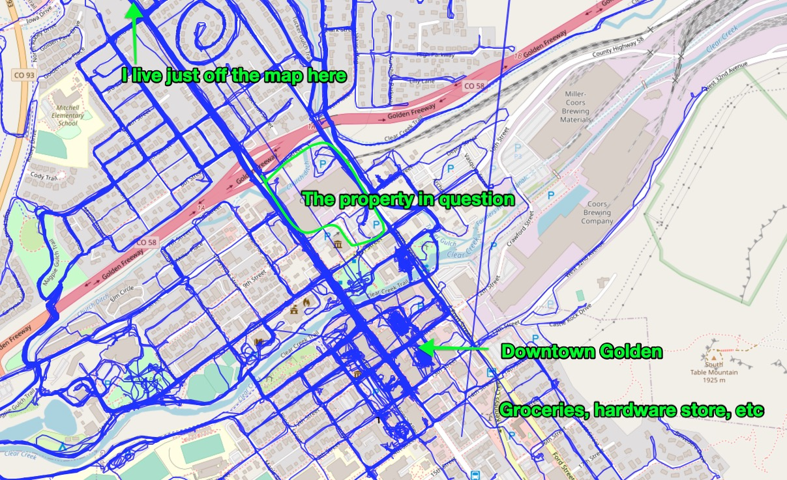

While I was biking around recently, I saw notes about an upcoming neighborhood meeting about some rezoning, a big lot in downtown Golden.

I went to the meeting (Thursday, July 22) and learned a lot.

Here's the lot in question:

I have ridden my bike past this property hundreds of times. It's directly between my house and downtown:

Blue lines are all the strava trips I've taken (by bike). See more here: [https://cryptic-sea-38287.herokuapp.com/](https://cryptic-sea-38287.herokuapp.com/)

There are two books that contain (broadly) everything an architect, land-user planner, or developer needs to maximize the value of the work they're doing, and minimize the "externalities" of their project.

If you're serious about cities being places that promote the wellbeing of their populations, the environment, etc, these are the two books you need to have on your bookshelf:

Fixing these problems in Golden takes three steps. Ideally, all three would be done, but any of them done in isolation at any level of implementation would be a step in the right direction:

### Step 1: Get Parking Right

Golden city staff must read and implement [The High Cost of Free Parking](https://www.amazon.com/High-Cost-Parking-Updated-Edition/dp/193236496X/ref=as_li_ss_tl?ie=UTF8&qid=1332084228&sr=8-1&linkCode=ll1&tag=markeurban-20&linkId=65aeac5942c99b794876bb2d2dc32bb0). 

No other "solution" will do anything but make the current situation worse. 

I'm writing more about parking here: 

👉  [parking in Golden, CO]({{ site.baseurl }})

### Step 2: Get Buildings right (location, size, use, etc)

Read [Order Without Design: How Markets Shape Cities](https://www.goodreads.com/book/show/39644188-order-without-design)

> But Josh this is a big academic book I don't want to read it...

It's not that big, it's quite approachable, but it's fine if you don't want to read it. Most modern planners have never read this book (I've asked about a dozen of them...) but they would be 100x better at their jobs (or they would at least stop making bad situations worse) if they'd read it.[^planners]

[^planners]: There's a lot more I'll say on "planners" soon - most of them mean well, and are highly constrained actors. Some of them are prevented from doing the right thing by broken political systems. Others are prevented from doing the right thing by ignorance. One of these is partically forgivable. 

This is THE book for anyone planning on spending a lot of money trying to solve a big problem in the city.

### Step 3: Give full evaluation to the racist intent behind modern zoning and it's impact of how cities have been built over the last century

- [The Color of Law: A Forgotten History of How Our Government Segregated America](https://www.goodreads.com/book/show/32191706-the-color-of-law)
- [The Slaughter of Cities: Urban Renewal as Ethnic Cleansing](https://www.fidelitypress.org/slaughter-of-cities)

## Hindrances to the City of Golden trending in the right direction

As you might imagine, this system is not stable. Things are always changing, and either getting better, or getting worse.

They're currently getting _worse_, and [the new zoning plan](https://www.guidinggolden.com/code-changes) that the city zoning staff is working on generally makes things worse, in addition to probably eating up about $1.5 million in budget and payroll. 

### Hindrance 1: Grossly Mismanaged parking

Parking is a scarce commodity, and like all commodities, _if you mismanage access to said commodity, there are downstream negative effects_. 

The solution is technical, not political. There are some complexities to it, but implementing this fix is well within the capacities of the full-time planning and engineering staff.

This comes from The High Cost of Free Parking by Donald Shoup. Read more on this here:

👉  [parking in Golden, CO]({{ site.baseurl }})

1. Set appropriate price for curb-side parking
2. Spend all revenue where it's collected
3. Abolish parking minimums

### Hindrance 2: Exclusionary zoning

Euclidean zoning, AKA [exclusionary zoning](https://en.wikipedia.org/wiki/Exclusionary_zoning), is killing our city. Serious people in the space don't debate that exclusionary zoning is terrible. 

Persons who support exclusionary zoning are as sophisticated in urban planning as doctors _who believe in [leeching](https://www.britannica.com/science/leeching)_ are sophisticated about the human body.

It's not up for debate. You don't have to believe you, and I'm actually eager to convince you otherwise, and I am willing to do so, and I'll do so gently, but _exclusionary zoning is horrible for cities and causes most of the harms facing cities today_. 

Here's more on this:

<blockquote class="twitter-tweet">
1/20 Thoughts on Denver&#39;s zoning and systemic racism.   Here&#39;s a screenshot from <a href="https://twitter.com/CityofDenver?ref_src=twsrc%5Etfw">@CityofDenver</a>&#39;s zoning map on <a href="https://t.co/Tzx271JS8u">https://t.co/Tzx271JS8u</a>.  This is textbook Euclidean Zoning, AKA &quot;Single-Use Zoning&quot;.  The problems of this form of zoning are well-known:<a href="https://t.co/WqiklxjB4h">https://t.co/WqiklxjB4h</a> <a href="https://t.co/7RDaFJlttS">pic.twitter.com/7RDaFJlttS</a>
&mdash; Josh Thompson (@josh_works) <a href="https://twitter.com/josh_works/status/1294726871574179840?ref_src=twsrc%5Etfw">August 15, 2020</a></blockquote>  

### Hindrance 3: Legally-imposed Minimums (lot size, setbacks)

Having "minimums" around lot sizes and setbacks wrecks cities. I'll add more sources at some point, but again, _this is not a contentious statement_. If you think it's politically charged, it's because you're thinking about the issue from the wrong angle. 

### Hindrance 4: Legally-imposed Maximums

Proscribing maximums (like floor area ratios, heights, densities) wrecks cities as much as the minimums do.

-------------------------

Most of the pleasant part of downtown that we all know and love is _wildly_ illegal according to modern zoning codes, because it violates minimums (setbacks) and maximums (floor area ratios).

Together, these minimums/maximums leave little room for new development - all the new development we get is the ugly stuff. The charming, efficient buildings of the past are all illegal.

More later.

### Resources

- [PC21-12 Coorstek 600 9th Street Rezoning, from the City of Golden planning staff](https://www.guidinggolden.com/planning-projects/news_feed/600-9th-street-rezoning)
- [Tryba Architcts (The company working w/Coors on the development)](https://www.trybaarchitects.com/people/john-mcintyre)