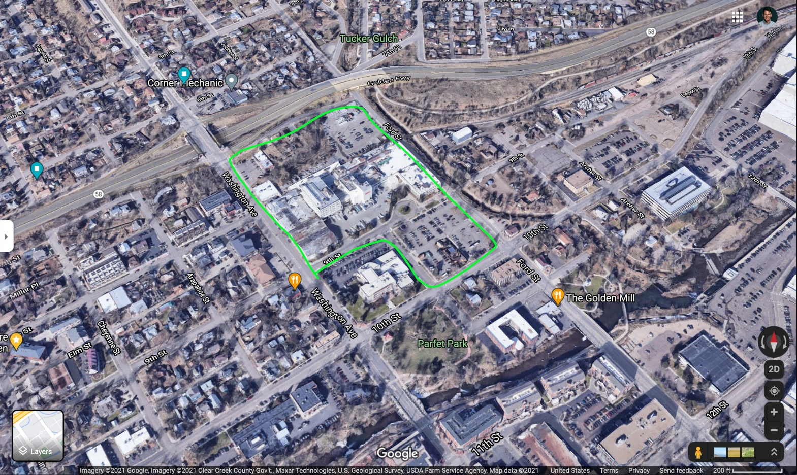

While I was biking around recently, I saw notes about an upcoming neighborhood meeting about some rezoning, a big lot in downtown Golden.

I went to the meeting (Thursday, July 22) and learned a lot.

Here's the lot in question:

I have ridden my bike past this property hundreds of times. It's directly between my house and downtown:

Blue lines are all the strava trips I've taken (by bike). See more here: [https://cryptic-sea-38287.herokuapp.com/](https://cryptic-sea-38287.herokuapp.com/)

Things I'm hoping to expand upon:

### Getting Parking Right

Golden city staff must read and implement [The High Cost of Free Parking](https://www.amazon.com/High-Cost-Parking-Updated-Edition/dp/193236496X/ref=as_li_ss_tl?ie=UTF8&qid=1332084228&sr=8-1&linkCode=ll1&tag=markeurban-20&linkId=65aeac5942c99b794876bb2d2dc32bb0). No other "solution" will do anything but make the current situation worse. 

### Getting Buildings right (location, size, use, etc)

[Order Without Design: How Markets Shape Cities](https://www.goodreads.com/book/show/39644188-order-without-design)

This is THE book for anyone planning on spending a lot of money trying to solve a big problem in the city.

### Giving full evaluation to the racist intent and impact of how cities have been built over the last century

[The Color of Law: A Forgotten History of How Our Government Segregated America](https://www.goodreads.com/book/show/32191706-the-color-of-law)

## Hindurances

### Mismanaged parking:

1. Set appropriate price for curb-side parking
2. Spend all revenue where it's collected
3. Abolish parking minimums

### Minimum lot size rules

### Maximum development rules 

- floor area ratios, set backs, etc. Most of the pleasent part of downtown that we all know and love is _wildly_ illegal according to modern zoning codes. 

Of course all new development is ugly. The charming, efficient buildings of the past are all illegal.

### Resources

- [PC21-12 Coorstek 600 9th Street Rezoning, from the City of Golden planning staff](https://www.guidinggolden.com/planning-projects/news_feed/600-9th-street-rezoning)
- [Tryba Architcts (The company working w/Coors on the development)](https://www.trybaarchitects.com/people/john-mcintyre)