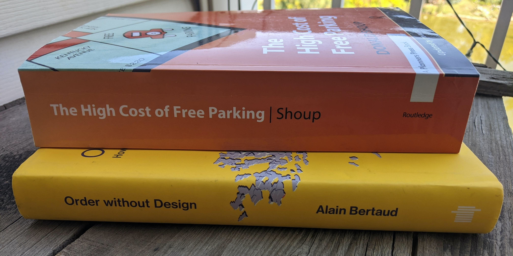

Parking in Golden is broken. 

This _deeply_ broken parking situation causes vehicle and pedestrian traffic in Golden to break, in the same way that if a machine on a manufacturing line breaks, adjacent components need to stop, or it will also malfunction.

The topic of parking (at least in the way I'll be talking about it) cannot be detangled from other components of physical and social characteristics of our lives. The system _of_ parking, and the system in which parking is only a component, is a complex, reactive system. [^complex-reactive-situation]

As is true for many complex, reactive systems, it's important to obtain a general understanding of the "ground truth", and if possible a wide understanding of the topic. 

[^complex-reactive-situation]: For a primer on this, read [An Introduction to Complex Adaptive Systems](https://fs.blog/2014/04/mental-model-complex-adaptive-systems/). 

      A complex, adaptive/reactive system changes in complicated ways when you chage the inputs. Also, take a look at [How Complex Systems Fail](https://how.complexsystems.fail/)

I'm defining parking as:

> That which relates to the storage of vehicles

And it relates to the following "kinds" of parking:

- short-term parking like how you park your private vehicle when you travel to a grocery store or a park, or a nice restaurant in a big city
- long-term parking like how you might park your vehicle in a garage, driveway, or street, at night or for a day, week, or month
- commercial parking like how commercial vehicles (semi-trailers, heavy commercial vehicles, light commercial vehicles, company cars, company trucks, _delivery vehicles_, and more) fulfill their purpose, be it transporting materials, tools, people, parcels to any specific place for any particular purpose for any particular length of time

Parking has different degrees of _urgency_ across different degrees of _time_. More on that later.

-------------------

> Wait. Who are you? Why are you talking about parking? 

I'm Josh. I live in Golden, Colorado, and my life, and the lives of everyone who lives in Golden, Denver, the front range, a city, the country, and the world, is being ruined by mismanaged parking.[^more-than-just-parking]

[^more-than-just-parking]: Parking is just one portion of the problem. A big one. And our broken parking regime isn't just the _cause_ of many problems, it's also a _result_ of other broken systems. See my [explainer about Robert Moses]({{ site.baseurl }}) for more.

I talk about parking (and other things related to cities) a lot. If you've spent any time with me, you've probably heard me talk (or rant. Sorry.) about things related to cities. I'm also extremely invested in the city of Golden, and am figuring out how to invest _even more_ in the city. 

Golden's mismanagement of parking is ruining the lives of the entire city, and everyone who travels to the city, and affects not just persons who drive, but persons who _cannot_ drive, even if they wished to, be they too young (children), too elderly, _and_ persons who would _rather not_ drive, for any particular reason. 

If you summed up all the people who could fit into each of the above categories, there would be tens of thousands of people who's wellbeing has been diminished _in just the last year_ by the City of Golden failing _for another year_ to manage parking correctly. 

I've wanted a spot where I could direct people to get several things:

1. a broad overview of how parking should be approached (from an academic & operational point of view)
2. a broad overview of evidence that parking is indeed being quite mishandled
3. A few heuristics you can take forward to evaluate the parking situation in your own day-to-day (warning, you might not be able to un-read any of what you're about to read)
4. an explanation of how to fix it

Eventually I'm going to be adding a TON of pictures, videos, timelapses, and more. For now, know that "parking" (that complex, reactive system) is one of the largest differences between the following pictures:

Compare these two images:

What's true in Charleston, South Carolina is true in Golden, Colorado. 

<!--more-->

## The Fix For Parking Problems

These two books contain 100% of the solution to the following problems in Golden:

- The parking problems
- the traffic problems
- the "unaffordable housing" problems
- the "unaffordable commercial space" problems
- the homelessness problems
- and more

Here's the summary of [The High Cost of Free Parking](https://www.amazon.com/High-Cost-Free-Parking-Updated/dp/193236496X), by Donald Shoup.

> Donald Shoup is Distinguished Research Professor in the Department of Urban Planning at the University of California, Los Angeles. His research has focused on how parking policies affect cities, the economy, and the environment. 
> 
> In _The High Cost of Free Parking_, published in 2005 and updated in 2011, Shoup recommends that cities should:
>
> 1. Charge fair market prices for on-street parking
> 2. Spend the revenue to benefit the metered neighborhoods
> 3. Remove off-street parking requirements. 

### Examining Golden-specific parking problems

Golden proudly proclaims that it has lots of free parking. Here's all of Golden's parking:

- Multiple parking garages
- multiple surface parking lots
- lots of curb space

MOST of the time, this parking is empty. 

Then, on weekends, (and often during the week) Golden gets tons of visitors. I love that Golden gets visitors. Except it sucks for everyone (visitor and resident alike) when the parking is a disaster.

One downtown neighborhood puts "closed to non-resident" signs up, and has employees of a security company sitting in their cars at the vehicle entrances. 

The remaining parking is full. stuffed to the gills. 

## Resources around the harms of parking minimums

<blockquote class="twitter-tweet">
Parking minimums, a thread.  Why? Because this is something many continue to approach from the perspective of &quot;well I drive and so everywhere I go needs to have parking.&quot;  Warning: This was the subject of my master&#39;s thesis, so... (1/16) <a href="https://t.co/scC4PqW3oD">pic.twitter.com/scC4PqW3oD</a>
&mdash; Luke Klipp 🏳️‍🌈 (@lukehklipp) <a href="https://twitter.com/lukehklipp/status/1339385302729691136?ref_src=twsrc%5Etfw">December 17, 2020</a></blockquote>  

### Further reading

- [Parking requirements and foundations are driving up the cost of multifamily housing](https://www.brookings.edu/research/parking-requirements-and-foundations-are-driving-up-the-cost-of-multifamily-housing/)
- [Oregon Just Ended Excessive Parking Mandates On Most Urban Lots](https://www.sightline.org/2020/12/14/oregon-big-parking-reform/)
- [There Are Too Many Unused Parking Spots Near Transit Stations And It’s Pushing Up Rent, RTD Report Says (Colorado Public Radio)](https://www.cpr.org/2020/12/17/there-are-too-many-unused-parking-spots-near-transit-stations-and-its-pushing-up-rent-rtd-report-says/)
- [Here’s how much space U.S. cities waste on parking](https://www.fastcompany.com/90202222/heres-how-much-space-u-s-cities-waste-on-parking)
- [Parkingmill: X-ray vision for parking](https://parkingmill.com/)

Todo:

https://twitter.com/josh_works/status/1295034724658737152

