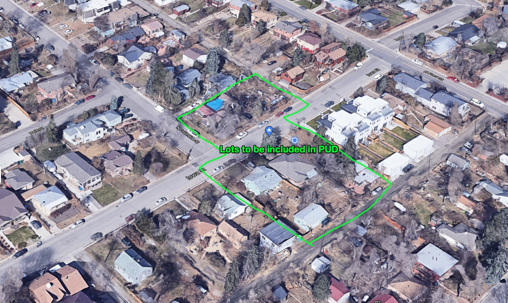

_This is a draft document, meant for circulation, will evolve with time and eventually be something we bring to the City of Golden for ratification, or whatever needs to happen to get this done in this zone. This document relates to [Collateralizing Mortgages and Loans With the Present Value of Rent Flow]({{ site.baseurl }})_

I, Josh Thompson, owner of 621 Iowa St, with my wife and the owners and rentors of the below properties, hereby request a Planned Unit Designation from the City of Golden, in accordence to the following terms.

# Dimensions/Boundaries of the PUD

Addresses included in the PUD, representing a contiguous territory and boundary.

- 648 Iowa St.
- 621 Iowa St.
- 623 Iowa St. 
- 619 Iowa St.
- 617 Iowa St.

Here's the specific properties, all owners and tenants of which desire to be included in the PUD:

# Property Owners of the lots inside of and around the PUD

For the rest of the document, the collection of properties will be "The PUD boundary zone" or some otherwise collected group. 

The owners of these included lots desire for their land to be included in this PUD, and will sign contracts or testaments to this fact if it would be helpful for obtaining this PUD.

All property owners and tenants are strongly invested in seeing this general plan be accomplished.

## Zone 1: Immediately-Impacted Property Owners (Adjacent)

Nearly everyone adjacent to the designated area, and 100% of the people I've spoken to about this, approve of this PUD and would not take actions to prevent it from being designated as such. 

## Zone 2: Impacted Property Owners/Residents (nearby)

Obviously, PUDs affect far more than just the immediately-adjacent properties. If we were to take an expansionist view of affected parties, we'd need to fill in the corners of the "space", so it would be inclusive of everyone who lived within a certain distance of _a_ boundary of the PUD. Here is that expansionist view:

## Zone 3: Affected by usage patterns

Finally, since roads are mobility networks, and _neighborhoods_ are a common unit of analysis, not just individual lots, here's the _neighborhood_ inclusivity of persons who would have some vested interest in this project:

# PUD Code Provisions

This PUD "application" will contain several sections, modeled roughly after the other PUD applications I could find on the City of Golden's website:

- [Golden Overlook PUD Amendment (PDF)](GoldenOverlookPUDAmendment.pdf)
- [Lookout Mountain PUD Sheet (PDF)](LookoutPUDSheet.pdf)
- [18.28.300 - (PUD) Planned unit development district. (Golden's Municipal Code)](https://library.municode.com/co/golden/codes/municipal_code?nodeId=TIT18PLZO_CH18.28USDERE_18.28.300PUPLUNDEDI)

## The role of the city

The role of the City and of its Agents is limited to providing connections to the trunk city networks for transport, water, sewer, and storm drainage.

## City easements

Existing city infrastructure within the boundaries of the PUD will be maintained, broadly, by a coalition between the PUD and the city. Easements currently owned by the city that extend beyond the physical boundaries of the road, sewer, and water network will be deemed unexercisable, and full possession will be remitted to the property owners.

## Rights of way

The owners representing the PUD will maintain the existing roads to ensure safe and adequate mobility network through-put.

Non-vehicular rights-of-way will be decided upon and maintained by the property owners.

-------------------

### Summarized language, initial draft:

All language copy-pasted from Alain Bertraud, [Order Without Design](https://www.goodreads.com/book/show/39644188-order-without-design), pasted below.

In specific, I want to model this PUD on the Indonesian Kampung. I'll copy-paste from the long quote, translating the described phenomina to a set of zoning rules legible to a local municipality.

As I have discussed this with neighbors (in all zones), and explained the genesis of where this language comes from, they have all eagerly endorsed the plan. To emphasize, this general approach and language has broad community support.

Below are sentences, as encountered in order, in their original form from the long quote shared below.

> In these two countries, the government allowed low-income households to use the standards they could afford and to make their own trade-offs between location, road space, lot space, and floor space. The government role was limited to providing connections from these settlements to the trunk city networks for transport, water, sewer, and storm drainage.

> Lots were subdivided, but always on the initiative of the original owner

> adjustments can be made to plot size, width of access to individual lots, and drainage of waste water

> standards were adjusted to increasing land values

> A network of small roads, footpaths, and passages was maintained, reflecting the former village structure.

> while the government concentrates its efforts not on housing construction but on gradually improving residential infrastructure and services to all residential settlements

## Long quote from _Order Without Design: How Markets Shape Cities_, p. 287

[...]

> Finally, housing supply could be greatly increased by improving the urban transport system. Areas with low demand because of poor accessibility to jobs have necessarily a low density. Improving accessibility to jobs by increasing trans port speed or introducing new transport technology should increase the de facto land supply of cities. Unless the regulatory and infrastructure housing supply constraints are removed, adding new subsidies to housing, whether supply side or demand side, would have very little effect on the welfare of the city's lowest income households.
> 
> The above example of inclusionary zoning is not just an anecdotal illustration of a poorly designed housing policy. It represents a trend in many of the most economically successful cities in the world. The increasing regulatory frenzy that characterizes some cities like New York imposes large economic costs on the entire country. In a paper published in 2015, the economists Chang-Tai Hsieh and Enrico Moretti found that, between 1964 and 2009, the high cost of housing in some US cities relative to wages had lowered aggregate US GDP by 13.5 percent:
> 
> Most of the loss was likely caused by increased constraints to housing supply in high productivity cities like New York, San Francisco and San Jose. Lowering regulatory constraints in these cities to the level of the median city would expand their work force and increase U.S. GDP by 9.5%
> 
> Many of the regulations recently introduced in cities around the world that aim to improve the housing consumption of low-income households, not only do not deliver the number of housing units promised, but also contribute to lowering the economic opportunity of the very people they are supposed to help. It is time to audit these regulations and policies, taking into account the increasingly valuable economic literature on the subject.
> 
### Cities Are Reluctant to Accept Housing Standards That Are Affordable for the Poor: The Exceptions
> 
> Cities in low-income countries, where urban migration annually adds a large number of unskilled people, cannot afford to subsidize the housing of the large number of poor. However, cities in Indonesia, using an "integration" approach to low income settlements, have been successful in absorbing new migrants into the urban labor force while maintaining an acceptable level of environmental health in the poorest neighborhoods.
> 
> In many Asian countries, large numbers of people migrating to cities have been creating dense urban villages in an urban setting but without any urban infrastructure. These small, simple structures provided the shelter these people needed at a price they could afford. It also allowed them to participate in the urban economy. However, the lack of connection to the city infrastructure soon created unacceptable sanitary conditions when these urban villages aggregated in large contiguous neighborhoods of several hundred thousand people. In addition, the lack of schools and health facilities contributed to slowing down or even prevent ing the integration of younger generations into urban society.
> 
> The predictable first reaction of governments has usually been to set minimum urbanization standards to prevent the legal construction of these unsanitary urban villages. The regulations made the situation worse, as they prevented these informal settlements from obtaining normal urban services from the municipality. They also created a risk of future demolition, which discouraged housing improvement that the households would have naturally done themselves. Eventually, many governments slowly regularized the older informal settlements in a piecemeal fashion, as is the practice in India, for instance. But the regularization of informal settlements usually had been conducted with a provision that after a set date, no more informal settlements would be regularized.
> 
> The outcome of these successive policies -- first ostracism, then benign neglect followed by reluctant integration -- has been disastrous. A significant share of the urban labor force, otherwise gainfully employed, live in large "informal" settlements often with unsafe water supplies, deficient sanitation, and sporadic solid waste collection. In Mumbai, one of the economic powerhouses of Asia, 60 percent of the population lives in slums.
> 
> I discuss below two case studies in Indonesia and China. **These countries, for different reasons and in different ways, took a different approach to integrating affordable low housing standards into the city infrastructure. The outcome for the poor migrant households was significantly better than in the countries where a strict regulatory approach had been followed. In these two countries, the government allowed low-income households to use the standards they could afford and to make their own trade-offs between location, road space, lot space, and floor space. The government role was limited to providing connections from these settlements to the trunk city networks for transport, water, sewer, and storm drainage.

### Example 3: Indonesia's Urban Enclaves with No Minimum Standards
> 
> In the densely populated island of Java, expanding cities absorb large existing villages, called "kampungs," whose population then integrates rapidly into the urban labor force. The former agricultural fields are soon built on by formal developers, while new informal constructions are added in the kampungs that have been absorbed into the city. So far, this is not too different from what happens in the rest of Asia, where countries are urbanizing rapidly. There is one important difference. Indonesian kampungs always had a formal robust administrative structure based on traditional laws, and that administrative structure has been able to survive their absorption into a larger urban municipality. 
> 
> Confronted with urbanization, the kampung traditional leadership organized themselves to absorb newcomers. Lots were subdivided, but always on the initiative of the original owner, and within the kampung traditional regulatory constraints and social norms. To use modern terminology, we could compare kampungs to a form of condominium association: They have their own internal regulations and norms, forming a sort of local authority at the lower level than a municipality or a ward. 
> 
> One difference from a condominium is that the kampung local microgovernment also has jurisdiction over land use. Therefore, adjustments can be made to plot size, width of access to individual lots, and drainage of waste water by using traditional norms developed over centuries of practice of good neighbor rules while overruling the development standards imposed by the municipality that surrounds the kampung. Formal developers building on adjacent greenfield land, however, had to follow the municipal land use standards rules concerning land development and subdivisions.
> 
> Because the income and preferences of new settlers were well known to the original kampung inhabitants, land use standards evolved to adjust to the new economic reality facing kampungs; standards were adjusted to increasing land values, so that plots would remain affordable to newcomers, who were usually poor migrants. Because the local traditional norms were respected, it did not result in an anarchic aggregation of houses that would be wasteful of land, as often happens in spontaneous squatter settlements where migrants aggregate without forming an organized community. A network of small roads, footpaths, and passages was maintained, reflecting the former village structure.
> 
> As Indonesian cities developed, the kampungs located closer to city centers densified more rapidly, as expected by their favorable locations closer to employment. The low income of their inhabitants, the lack of access to finance, the frag mentation of properties into small lots, and the lack of access to infrastructure prevented the construction of multistory buildings. However, the subdivision of existing village lots and the narrowness of internal access streets reflected the opportunity cost of land and soon resulted in much higher densities than that of the original villages, often resulting in densities of more than 500 people per hectare.
> 
> However, this increased density has a downside. The traditional source of water and means of sanitation -- consisting of shallow wells and seepage pits -- became grossly inadequate to serve the new higher densities. The low absorption capacity of the traditional sanitary system transformed the kampungs into dense unsanitary slums. The traditional storm drainage network, built around former irrigation canals, was insufficient to prevent flooding during the monsoon because of enhanced impermeability of the area caused by urbanization. 
> 
### Innovative Housing Policy Concentrating Subsidies on Infrastructure, Not on Housing Structure
> 
> So far the history of the Indonesian kampungs does not appear to be very different from that of informal settlements in many other developing countries. What made a difference was a decision taken in 1969 by the government of Indonesia to concentrate its resources on the improvement of the kampungs' infrastructure without trying to remove or restructure the existing housing, however small or inadequate it was. The provision of urban infrastructure and services to kampungs was called the Kampung Improvement Program (KIP). Compared to the prevailing housing policies of developing countries in the 1960s, which consisted mostly of bulldozing informal settlements to relocate their inhabitants in public housing flats, this approach was revolutionary.
> 
> And, even more exceptional, since 1969 to this day, the Indonesian government's support for KIP has been unwavering, in spite of political upheaval and constitutional changes. The government housing policy objective consists of allowing the poor to settle in and around existing villages at the standards of their choice, while the government concentrates its efforts not on housing construction but on gradually improving residential infrastructure and services to all residential settlements. The policy has proved largely successful. The living and sanitary standards in most kampungs of Indonesia are far above what is found in informal settlements in countries with similar GDPs.
> 
> No kampung was ever bulldozed. No large groups of households were promised free housing. No large central government institution has tried to replace the many small KIP contracts for civil work on infrastructure in kampungs with larger contracts involving the construction of a massive program of public housing.
> 
> Operationally, the KIP continues to provide financial and technical assistance to the existing kampungs' traditional administrative structure to build connections to the municipal water supply network, to pave foot paths, to build drains using existing rights-of-way, to establish a system of solid waste collection that feeds into main collection bins that are part of the municipal solid waste collection system. The maintenance of the internal network and waste collection was and to this day is managed by the kampung community itself, with some financial assistance from the municipal government. The decentralization of decision making and the participation of the communities were embedded in the KIP from the beginning. 
> 
> The KIP has been complemented with citywide investments in transport and most importantly for Southeast Asia, in storm drainage networks to prevent periodic flooding in residential areas
> 
> Indonesia, with a GDP per capita of US$10,500 in 2015, remains a lower-middle-income country, according to the World Bank. The overall standards of living reflect this income category. However, because the government concentrated its scarce resources on providing urban infrastructure to all urban residents, instead of increasing the housing consumption of a few poor households selected by lottery for public housing, every poor Indonesian received benefits. And these benefits increase over time. The government focus on infrastructure assistance allowed households to use their own resources to invest in their own housing, either as self-occupied dwellings or as investment in rental housing. The housing standards, defined as the size and quality of the structure, may therefore vary from very low to good in the same neighborhood, but access to safe water, sanitation, education, and health is ensured for all.
> 
> The demand-driven land use standards allowed by regulations in Indonesia are illustrated by the site plans of two neighborhoods in Surabaya, Indonesia, as surveyed in 2010 (figure 6.24). On the left in the figure, a kampung site plan shows the variety of plot and housing sizes that are possible in the same neighborhood. Some structures located in the back of lots facing the main passageways are very small and of poor quality, but they have access to safe water and sanitation. They have also access to the same schools and health facilities as their more affluent neighbors.
> 
> TODO: ADD PICTURES FROM BOOK
> 
> The road system allows only emergency and construction vehicles but is adequate for local motorcycle and pedestrian traffic. On the right in the figure, a site plan designed by a formal developer, which shows a different, more standard type of residential layout with much less variety in lot size and more house area, reflecting middle-class standards. homogeneity in house area, reflecting middle-class standards.

### Kampung Integration Policy Has Successfully Provided a Flow of Low-Income Housing

> Because the kampung boundaries have always been protected since Indonesia started its rapid urbanization, kampungs are found in every neighborhood of Indonesian cities. Consequently, kampungs are always located side by side with commercial areas and higher-income areas, providing a socially desirable income mix at the neighborhood level. Because kampungs and middle-class areas share the same trunk infrastructure for water and sanitation, little discrimination is possible in public investment. 
> 
> I have observed kampungs' evolution and improvement on a regular basis, since my first work trip to Indonesia in 1977. Many housing units in kampung areas look more middle class than low income. This reflects the increase in house hold incomes in Indonesia over this period. The inability to use a car as a means of transport in kampungs (because of the narrowness of the streets) prevents any large displacement of the poor from the best-located kampungs. The low road standards are the best guarantee against massive gentrification.
> 
> Some households that have reached sufficiently high incomes are likely to leave the kampung and move into formal development neighborhoods. This movement creates vacancies in the kampungs that are immediately filled with holds who rent or buy a dwelling. Low-income households do not need to be on poorer a waiting list and do not have to submit a proof of their income to buy or rent in house a kampung. Expansion zoning plans are reserving land around existing kampungs located in the periphery to ensure a flow of new low-income housing in the future.
> 
> **The Indonesia kampungs and the KIP program demonstrate that it is possible for a government to provide large benefits to its large low-income population without creating long waiting lists. It shows that allowing standards to adjust and, consequently, population densities to float, not only provides affordable housing but also improves the city structure by allowing higher densities in areas accessible to jobs.**

## Alain Bertraud's specific feedback on this document

I (Josh) am friends with Alain and Marie-Agnes Bertraud, the authors of _Order Without Design: How Markets Shape Cities_.

When I sent him a draft of this document, Alain said:

> Your proposed PUD is an imaginative adaptation to a Colorado subdivision of the Kampung and Chinese urban village concept described in my book.
> 
> I hope that it gets approved under Colorado law! 
>
> I hope that other people will also imitate the idea with some variations, ensuring constant adaptation to changing socio-economic conditions.
> 
> **This new way of changing land use initiated by current occupiers would be a wonderful escape from the arbitrary rigidity of existing zoning laws, which prevent demand-driven land use adaption.**
> 
> Your [preliminary financial calculation]({{ site.baseurl }}) also demonstrates that it is possible to have an excellent financial return by unit of land while creating affordable housing units at standards that are acceptable to the end-user. 

_emphasis mine_

## FAQ

This document prompts many questions. If you have any, consider leaving a comment below, or shoot me an email about it, or text me, or whatever. I'll update it accordingly.

### What exactly is a PUD again?

TL;DR: A "Planned Unit Development District" is a legal document, enacted via a political process[^political-process] by which the City approves of modifications to the existing rules and regulations, as applied to a specific piece of land.

[^political-process]:  Sequential approval starting with: `planning department`, then going to `planning commission`, and finally to `city council`

The Planning and Zoning Office of Golden [defines](https://library.municode.com/co/golden/codes/municipal_code?nodeId=TIT18PLZO_CH18.28USDERE_18.28.300PUPLUNDEDI) a PUD as:

> (1) The PUD district permits the community and economic development of land which is suitable in location and character for the uses proposed as unified and integrated developments in accordance with detailed development plans. The PUD district also provides for specific land uses not permitted in other zone districts. The PUD district is intended to provide a means of accomplishing the following objectives:
> 
>   (a) To provide for development concepts not otherwise permitted within standard zone districts.
> 
>   (b) To provide flexibility, unity and diversity in land community and economic development, resulting in convenient and harmonious groupings of uses, structures and common facilities; varied type design and layout of housing and other buildings; and appropriate relationships of open spaces to intended uses and structures.
> 
>   (c) To provide for the public health, safety, integrity and general welfare, and otherwise achieve the purposes as provided for within the Planned Unit Development Act of 1972, Title 24, Article 67, Colorado Revised Statutes 1973, as amended.
> 
>   (d) To provide for phased development, the more efficient use of land and the public and private services needed therefor, and reflect changes in the technology of land development.
> 
>   (e) To provide for land development flexibility in dwelling type, bulk, density, intensity and open space, as a policy which Golden wishes to encourage; and, as a corollary, regulate certain proposed land development which would distort the objective of Golden's zoning.
> 
>   (f) To encourage integrated planning in order to achieve the above purposes.
> 
> (2) Uses within a PUD development may be multiple in nature and may include uses not otherwise permitted within the same zone district. The location and relationship of these uses shall be as established in and conform to the policies and standards contained within the comprehensive plan and other appropriate adopted and approved plans, including but not limited to locational criteria within that comprehensive plan. 

### So why do you want to get this collection of lots declared a PUD?

Look at reason 18.28.300.1.a:

> The PUD district is intended to provide a means of accomplishing the following objectives: 
>
> To provide for development concepts not otherwise permitted within standard zone districts. 

I've got some development concepts not otherwise permitted within standard zone districts. Full stop. That's why I want the PUD. I choose to not give up on what I want to accomplish because it's not _currently_ permitted on my lot. 

For example - I'd love for there to be a vegetable stand that is sometimes operating on my street. I'd gladly build a space for someone, and let them operate it out of my lot. That structure, and that business, would be so illegal under current rules people laugh at me for even wanting to do this. [I'm not afraid to look stupid](https://danluu.com/look-stupid/), so here I am.

### Who's involved? Are you trying to get other people's property rezoned out from under them?

Nope. Everyone involved is strongly supportive. That means, at minimum:

- The owners of all involved lots
- If there are tenants/renters, the renters are strongly supportive
- Many, many neighbors adjacent to the PUD, along Iowa St, Ford St, Washington St, and more

Once I know what sort of formal attestations of support I need to be able to demonstrate, and who I need it from, I'll obtain it. 

If it's people signing a document, they'll sign a document. 

If it's people showing up at a hearing, they'll show up at a hearing. 

If, for political reasons, from the perspective of Zonning, Planning, or City Council, it is advantageous for more or less people/lots to be included within the zone of the PUD, I'll adjust accordingly. 

There are many, many good things that will come about for the residents within and adjacent to the PUD, when this goes through. 

### Why are you trying to get a PUD? Why not build to the existing code?

I desire _flexibility_ more than almost anything else, so I (and my neighbors) can iterate and experiment with things, _and_ unlock traditional financing opportunities based off our land. 

We cannot finance development projects in a reasonable way, because we cannot use fractions of our land as collateral, which is a deviation from how land has traditionally been used. 

I spoke with a land-use lawyer at [Fox Rothschild](https://www.foxrothschild.com/) about this, she agreed that a PUD made the most sense for the overall direction I'm trying to go.

Part of the problem with building to the current code is that the first step of _every_ building project is to get permission for the project from the city, which requires that you submit a plan for the _finished_ project.

I'm a software developer. Modern zoning forces all development projects into a "waterfall" project management strategy.[^waterfall] This PUD basically allows for a property owner to adapt an agile project management approach[^agile].

[^waterfall]: AKA "the linear sequential lifecycle model". The entire software development industry jokes about the insanity of having the finished product spec'd out, and then building _that_, regardless of what you learn/uncover/discover along the way. "Agile" is what everyone tries to do today, and I refuse to apply known-bad planning processes to my own property. 

[^agile]: "Agile" software development is... complicated. There's a famous and rather nostalgia-inducing website that outlines the [principles behind the agile manifesto](http://agilemanifesto.org/principles.html). Check it out. 

### What do you want to eventually build?

Critically, I am not quite sure. Once the City approves of the PUD, I'll start building out projects. Nearly everything I'll do, I plan on doing myself or with just a small group of people. I'll GC my own projects, I'll QA my own projects, and I'll manage everything I build. 

I want to aid the neighborhood in implementing best-practices from:

- [A Pattern Language: Towns, Buildings, Construction (Center for Environmental Structure Series)](https://www.amazon.com/Pattern-Language-Buildings-Construction-Environmental/dp/0195019199)
- [The Timeless Way of Building](https://www.amazon.com/Timeless-Way-Building-Christopher-Alexander/dp/0195024028/ref=sr_1_2?dchild=1&keywords=christopher+alexander&qid=1634835871&s=books&sr=1-2)
- the vast "sustainable architecture" resources out there

