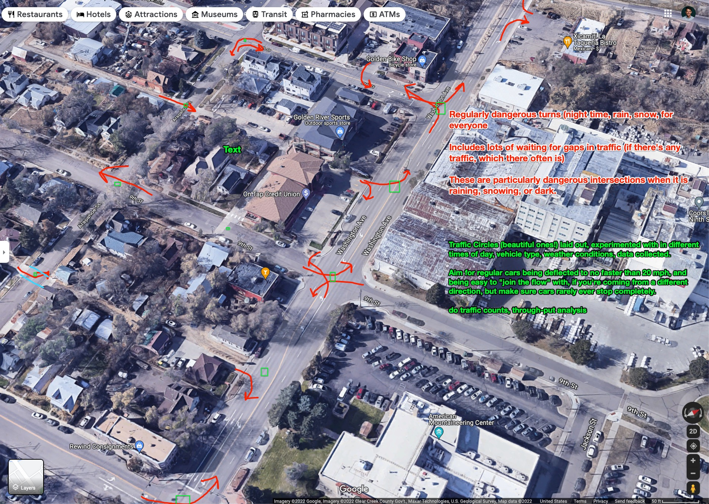
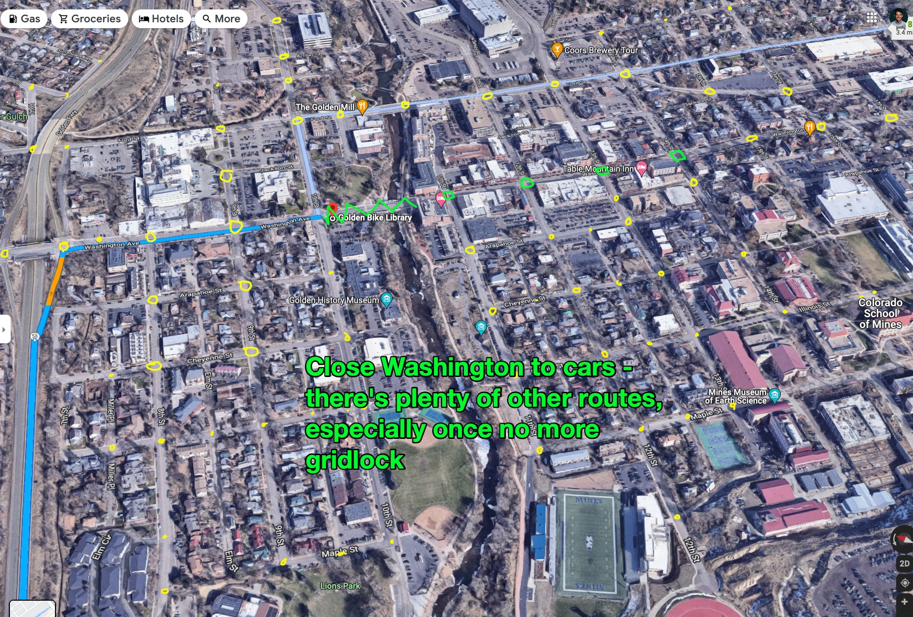
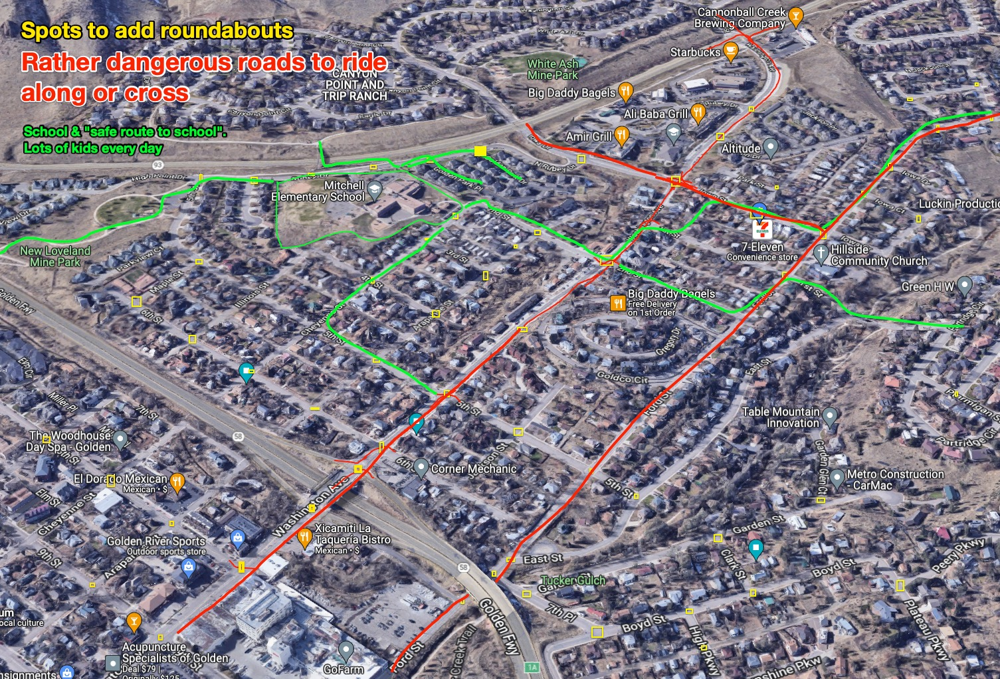

_I'm desperately trying to work through a giant back-log of writings. Please see [write it now]({{ site.baseurl }}) for more. I'm spending only a few minutes on this, forgive my errors._

Of late, I've had a _lot_ of conversations about roundabouts. I'm basically trying to explain the ways that a mobility network could be much improved, in terms of how well it does it's job of providing various place-connecting services.

In some cases, I'm learning interesting things about them (or news about how they're interacting with the world today, in March 2022.)

## What I think should be done, from an "ecosystem" perspective

Aim to replace stop signs and traffic lights with traffic circles. This reduces the rushing and hard acceleration stuff that's common with stop lights and the vehicle dynamics around them.

Aim to deliver a "consistent experience" for drivers navigating around Golden. A more-or-less 20-mph drive, once you're in your car, to a near-by highway[^travel-time].

[^travel-time]: I've got thoughts on how to calculate trip-time. It's something like: `When you say "I need eggs, broccoli, and a bottle of wine", how long until you're back with those things?` 

Robert Moses tried to build highways from everywhere to everywhere. He was right to pursue `convenient travel`, he just didn't have a good grasp of `for whom`.  

We're so, so far from this reality right now.

> But Josh the highways are not perfect either...

You're right! I've got thoughts on fixing the highway, but might as well do this one step at a time. When there is congestion (and oh, there is congestion) roundabouts are not at fault. Roundabouts are great solutions to part of this complicated puzzle we've got here. 

I'll talk about congestion at some point. Read Donald Shoup's [The High Cost of Free Parking](https://www.amazon.com/High-Cost-Parking-Updated-Edition/dp/193236496X/ref=as_li_ss_tl?ie=UTF8&qid=1332084228&sr=8-1&linkCode=ll1&tag=markeurban-20&linkId=65aeac5942c99b794876bb2d2dc32bb0) until then. 


## News and articles

- [These Americans Are Just Going Around in Circles. It Helps the Climate. An Indiana city has the most roundabouts in the country. They’ve saved lives and reduced injuries from crashes — and lowered carbon emissions.](https://www.nytimes.com/2021/11/20/climate/roundabouts-climate-emissions-driving.html)

The above NYT article. This is how I read the occasional NYT article:

```
curl -L https://www.nytimes.com/2021/11/20/climate/roundabouts-climate-emissions-driving.html -o nyt.html 
open nyt.html
```

## My own mapping projects

### Rails, Leaflet, GIS stuff

Mostly, these are so I can get kick the tires on some software-related challenge, but here's a link to an intersection that would be well served by a tiny traffic circle:

[https://leaflet-gis-rails-practice.herokuapp.com/point_of_interests/4](https://leaflet-gis-rails-practice.herokuapp.com/point_of_interests/4)

### OpenStreetMaps, Strava API, polylines

- [base repository](https://github.com/josh-works/strava_run_polylines_osm/tree/main)
- [live page on heroku](https://josh-strava-heatmap.herokuapp.com/)


## Examples of "good" and "bad" traffic circles

There are MANY kinds of traffic circles, they have tradeoffs in size, cost, speed, experience, etc.

There's also a lot about traffic circles that isn't really "the job" of the traffic circle, like "how fast is the vehicle going when it approaches a traffic circle". If a car is going "too fast", the traffic circle might not be great, so the stuff that kinda... "connects" traffic circles to each other (and to other non-traffic-circle-things) matters. 

### Examples of some nice traffic circles

- I'll get pictures at some point

### examples of not-nice traffic circles

- i'll get pictures at some point

## Traffic circles can be very low-key, or intense

### low

- as simple as a tire on the ground, or a rock, or a tree, in the middle of a small intersection
- https://www.strava.com/activities/6759764602
- 


### Medium

- a "square" of at least a few feet, or maybe a casual larger circle

### High

- something intense, multiple lanes for vehicle traffic. The throughput-per-minute probably isn't very good, the rest of the network is strained, it's a bandaid. 

Anything with two+ lanes counts as intense, IMO. I don't really like "intense" traffic circles that much, or, at least, you and I probably agree about things that are not great about them: 


## Acoustic benefits

Traffic circles, embedded in healthy networks, don't require much breaking or accelerating, and they do it in a "gentle" way. Much less vehicle noise, because stop lights and stop signs invite a LOT of aggressive acceleration.

Anyone that lives within a few hundred yards of that intersection is affected by it. Anyone who lives near ANY intersection like this, it invites constant noise, and when the noise isn't constant, it's punctuated by a distinctive sound of vehicle acceleration. Again, personally, might not be you in your vehicle, but someone with a loud car is accelerating hard out of that intersection, it's ever-present. 

The volume and interruption far exceeds any noise coming from people. (Sound system, crowds) and I wish I could petition for "noise treatment" around roads that caused excessive DB readings alongside the road. 

## Safety and urgency and rushing

I _think_ that when people look at these pictures, they see what's in the screenshot. Concrete, lots of space, lots of clutter with this "traffic circle" idea. 

What I'd rather you think about is what it is like using this intersection in the following permutations. There are at least nine:

1. At all times of day
2. In the normal varieties of local weather
3. In the normal patterns of seasonal use
4. with a normal distribution of ages, abilities, incomes, etc

For example, each of these red lines indicates a turning direction someone has to do that is at _least_ occasionally dangerous, given sight-lines and traffic speeds. The green boxes represent where we could consider adding traffic circles:



Some of these 'simpler' intersections could be _mostly_ 'fixed' with a small-to-medium temporary/home-made-but-beautiful traffic circle.

Here's a system-wide example of what the "feel" of a system-wide rollout of traffic circles could be. Remember, aiming for really fast, consistent, smooth travel-times, for everyone. Never coming to a full stop, never feeling like they have to rush[^stop-signs-traffic-lights].



[^stop-signs-traffic-lights]: This 'never fully stopping, never rushing' rule is lovely.

Well-designed and well-varied traffic circles (and things around traffic circles) make for pleasant and smooth driving for drivers. It's really important to hear, clearly, that _this is an improvement for drivers!_


## Tactical Urbanism Adjacent Concepts/news

- [https://mobile.twitter.com/sbrix/status/1185209075170267136](https://mobile.twitter.com/sbrix/status/1185209075170267136)
- [https://www.saferoutespartnership.org/blog/neighbors-south-tucson-transform-their-school-crossing-tactical-urbanism-traffic-circle](https://www.saferoutespartnership.org/blog/neighbors-south-tucson-transform-their-school-crossing-tactical-urbanism-traffic-circle)
- [https://issuu.com/streetplanscollaborative/docs/tu-guide_to_materials_and_design_v1/112](https://issuu.com/streetplanscollaborative/docs/tu-guide_to_materials_and_design_v1/112)


## invisible-women-inspired data collection

If ever there was a canon for a modern, earnest-effort desire to participate well in the conversation, I feel like [Invisible Women: Data Bias in a World Designed for Men](https://www.amazon.com/Invisible-Women-Data-World-Designed/dp/1419729071) is a good choice.

I'm happy to hear your comments and criticisms, and if you tell me you've read the book or something like that, I'll be thrilled.

- [Numina: Know your streets](https://numina.co/)
- [Strava Metro data (this map is of Denver AND GOLDEN!)](https://metroview.strava.com/map/demo)
- [in-citu: transparency and intelligent planning](https://www.incitu.us/)
- [Order Without Design: How Markets Shape Cities](https://www.goodreads.com/book/show/39644188-order-without-design?from_search=true)

## FAQs

### What about commercial businesses serving downtown businesses?

Lots of good solutions. I don't really think it's necessary to have a semi truck driving down washington, and guess what? The semi truck drivers hate being there too! 

I bet we could hang out, catch the semi truck drivers as they come in, and find good ways to help them get where they need to for deliveries, in a quick and easy way. Eventually figure out how to "publish" it to other future truckers. Also, it's hard to build a pleasant city exclusively around the needs of semitrucks, so lets wait to hear from them before making a big deal out of this.

### There's this roundabout near here that I don't like...

That's not a question, but I agree. I'm not sure exactly which one you're talking about, but there are a few around here that are not great. I think it's tricky to have two-lane roundabouts, and in general, the VAST majority would look way more low-key, like a sign in the middle of the intersection.

### But what about [my neighborhood]

Good question. I live in "north Golden", so here's the direction I'd like my 'hood' to go:



I've lived here for a year, these roads are VERY DANGEROUS for lots of the people who use them, in many very normal conditions during the year. Roundabouts are what make things safer, smoother, more interesting, more pretty, quieter, calmer. 

### But what about [other thing]

Like I've said before, roundabouts are just one piece of the puzzle. 


## more related resources

- [Ask Marianne: Boulders and tire-tolerant plants for the traffic circle](https://www.seattlepi.com/lifestyle/homegarden/article/Ask-Marianne-Boulders-and-tire-tolerant-plants-1067567.php)
- [The City as an Eco System Or, Nature Loves Edges](https://wrathofgnon.substack.com/p/the-city-as-an-eco-system?utm_source=url&s=r)
- [the high cost of free parking](https://www.amazon.com/High-Cost-Parking-Updated-Edition/dp/193236496X/ref=as_li_ss_tl?ie=UTF8&qid=1332084228&sr=8-1&linkCode=ll1&tag=markeurban-20&linkId=65aeac5942c99b794876bb2d2dc32bb0)


## In summary

Everything is tradeoffs, and when things work well, a thoughtful, well-crafted traffic circle is a great way to solve a real problem, and generally everyone who uses it feels good about it. 

When embedded in a healthy mobility network, a well-designed traffic circle casually allows safe travel in all directions, from all directions, for all participants, in a way that is high-throughput and low-wait-time for all users, in all conditions, at all times of day. 

Safely. 

I believe some of the benefits of traffic circles are illegible, but enough are legible and i'll bet money that we'll have a failure to disagree in any way, shape, or form, on traffic circles. 

Email me if you'd like to put that to the test in a public or private way. 

