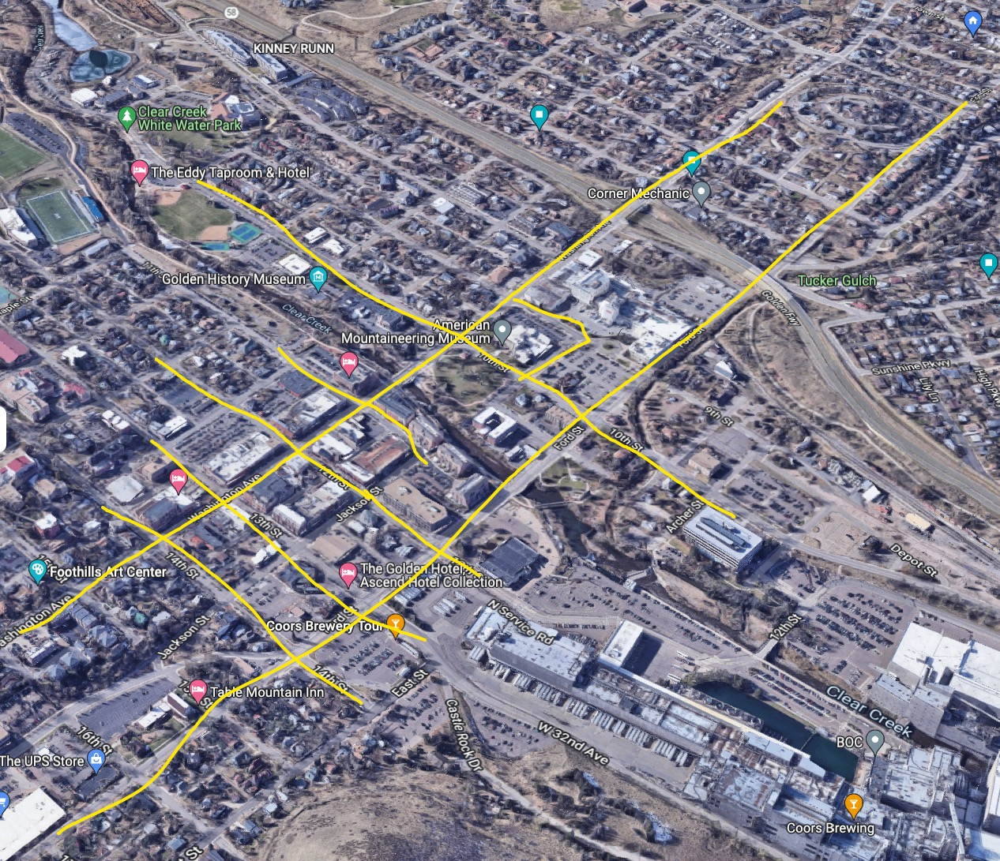
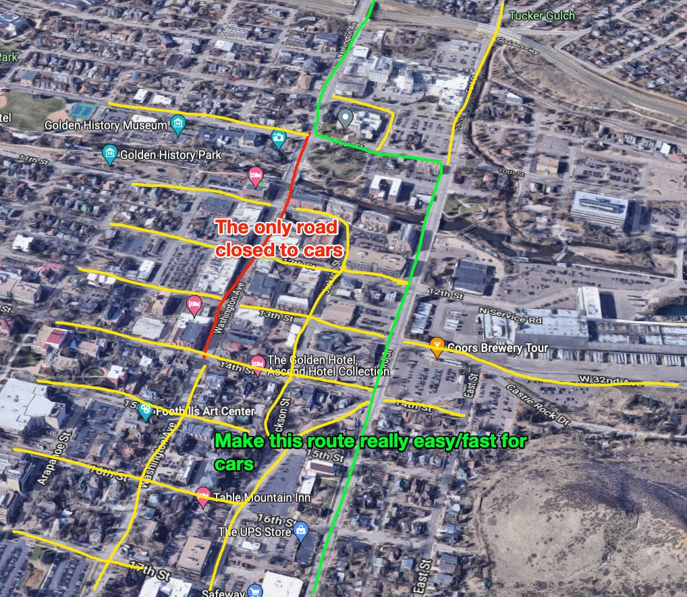

## Do all of these, in the right order/way/buy-in:

1. Install car-friendly roundabouts targeting ~20 mph throughput throughout the city. Please see [about roundabouts]({{ site.baseurl }})
1. Block off Washington over the bridge and through downtown, completely. (people can drive along those fancy highways we have, rt 6 and 58)

That's it!

Golden before:

Golden after:

The green line would be made easy for cars to move along.

The yellow lines would indicate where "people first" road design would be used, ultimately, though it'll take a variety of treatments to get it all safe/pleasant/usable in all conditions.

It's not that big of a change, to the cars. This won't fix all the bad traffic, but it will help.

Critically, if you can naturally keep cars (and other vehicles) moving in a close-to-free-flow way, now you can loop streetcars back into the picture, because they can keep up with traffic and such

## Resources worth reading

- [The Forgotten Story of Harbor Drive: Portland's Demolished Freeway (Peter Dibble)](https://www.youtube.com/watch?v=l2_yNrP0hCY)
- [About Roundabouts]({{ site.baseurl }})