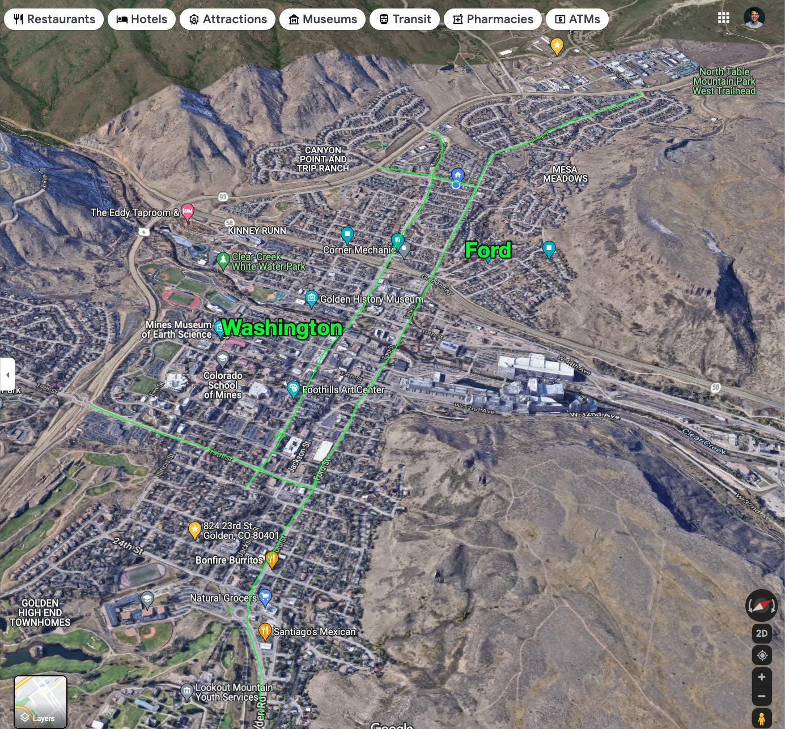
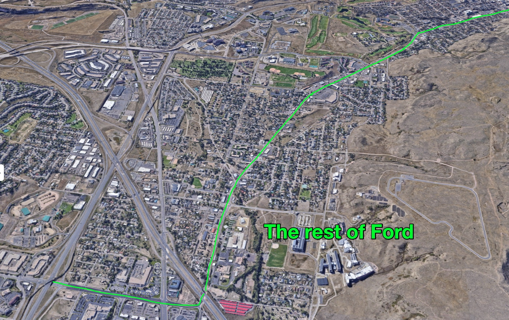

Do all of these, in the right order/way/buy-in. _btw, i'm pretending it's easy. it's not trivial, but it is doable_:

## Step 1: Install car-friendly roundabouts targeting a ~20 mph throughput speed throughout the city _and eliminate all stopsigns and stoplights_

Please see [about roundabouts]({{ site.baseurl }}). 

It might not be possible to eliminate _every_ stop sign and light, but I think a 90% reduction is very reasonable. 

You'll know it's working when vehicles, with very minimal signage, comfortably and casually move through the city at a speed of about about 20 miles per hour, no matter where they're starting and finishing their journey.

## Step 2: increase friction to drivers trying to cut through Golden

Here's how google maps "views" the primary roads through some of Golden:

And here's Ford, which you can see very clearly is also many other _big_ roads:

## Step 4: Fix the average throughput problem on rt 6

1. Block off Washington over the bridge and through downtown, completely. (please see below "after" )

That's it!

Golden before:

Golden after:

The green line would be made easy for cars to move along.

The yellow lines would indicate where "people first" road design would be used, ultimately, though it'll take a variety of treatments to get it all safe/pleasant/usable in all conditions, but at minimum all intersections would be [roundabouts]({{ site.baseurl }}).

It's not that big of a change, to the cars. This won't fix all the bad traffic, but it will help.

Critically, if you can naturally keep cars (and other vehicles) moving in a close-to-free-flow way, now you can loop streetcars back into the picture, because they can keep up with traffic and such

## Resources worth reading

- [The Forgotten Story of Harbor Drive: Portland's Demolished Freeway (Peter Dibble)](https://www.youtube.com/watch?v=l2_yNrP0hCY)
- [About Roundabouts]({{ site.baseurl }})