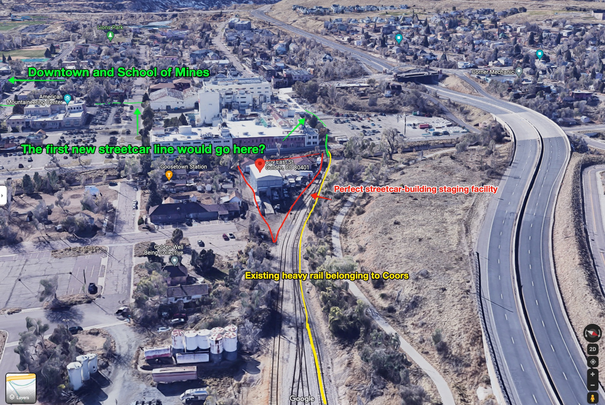

I was describing this two or three stage plan to a friend the other day. They _almost_ understood it, but since they don't live in Golden, and have not spent a lot of their life nerding out on "urban mobility infrastructure", they didn't quite get it.

Since I'm trying to [write things quickly, or at least now]({{ site.baseurl }}), I'm doing a quick little visual of what I wanted to propose to the involved parties.

## The involved parties

I think there are three institutions that, if working together in interesting ways, could build a very interesting piece of infrastructure:

1. School of Mines
2. CoorsTek
3. Coors

School of Mines could create a streetcar/urban-mobility-infrastructure addition to their curriculum, and start getting students involved with (and, as soon as possible, in charge of) planning, designing, building, and operating a growing streetcar network. 

Some more context [here]({{ site.baseurl }}#trains--streetcars-1920-era)

## Step 1

The steps. None of these are small steps, but are within the capacities of one or two people to manage each of the primary constituent steps, and the on-the-ground-help of no more than a dozen workers at a single time.

Here's what _could_ be the first streetcar line, connecting an existing heavy rail line

Here's another possible vision, which would get some streetcar running _back_ through downtown:

sub-tasks:

### start pricing/buying narrow-gauge railway.

I have a friend that was the \#1 steel-seller in Colorado, he'll get us where we need to go.

Narrow-gauge, because (from [wikipedia](https://en.wikipedia.org/wiki/Narrow-gauge_railway)):

> Since narrow-gauge railways are usually built with tighter curves, smaller structure gauges, and lighter rails, they can be less costly to build, equip, and operate than standard- or broad-gauge railways (particularly in mountainous or difficult terrain).[1] Lower-cost narrow-gauge railways are often used in mountainous terrain, where engineering savings can be substantial. Lower-cost narrow-gauge railways are often built to serve industries as well as sparsely populated communities where the traffic potential would not justify the cost of a standard- or broad-gauge line. Narrow-gauge railways have specialised use in mines and other environments where a small structure gauge necessitates a small loading gauge. 

while the steel is shipping, start building the trolleys that would be used to move materials and supplies and equipment along the line as it's being built. They could be fairly cheap, but again, this is about rapid iteration and experimentation.

### Obtain that facility at 809 East St for School of Mines

rumor has it the owner wants to get rid of it/might be declaring bankruptcy already, because Coors doesn't need the railcar maintenance facility anymore. Here's what exists there right now:

Start getting equipment and letting interested people self-select into the project. 

## Step 2

Now to start getting the street car network sorta "mixed into" school of mines space:

Here's some ideas of where some new lines might be added:

## Step 3

If step 2 looked impossibly huge to you, and like 10x what seems reasonable, I get it. Lets actually dramatically shrink step 2, and instead get Mines to treat it's entire campus as a bit of a laboratory for this streetcar thing, learning how to operate it, put them up for the night, get them ready for the day, run them, etc.

Maybe Mines will figure out how to make autonomous streetcars, similar to the autonomous busses it drives around. I bet someone there could.

Here's a much smaller version of building some rail. Obviously these are just ideas, but hopefully you can start seeing how this could lead to a growing body of knowledge and understanding.

# How to fund it

For starters, the first test line for school of mines students could probably be had quite cheap - school of mines students will provide much of the design and experimentation and labor, as they build out their streetcar-building curriculum. 

## What to buy

Off the top of the head:

> struts, electrical, concrete, trollies, repair equipment infrastructure, powerhouse buildings, PedX materials, paints, etc

It's not cheap, but I think one could arrange to purchase the raw materials, turn them over to School of Mines students, support them as much as possible from Coors' staff (to teach all sorts of stuff), and, in letting the students plan it out and execute it, it would be possible to end up with a functioning screetcar line. 
  

For starters, steel railway. Steel isn't _insanely_ expensive. I asked a friend who used to do commercial steel sales in Colorado - he would sell the rolls of steel that would be fabricated/worked into other forms, but he's got lots of good information. Copy/pasting from some emails:

> Looks like ASCE (American Society of Civil Engineers) recommend a specific rail for light rail applications after a quick search. The steel is a 900A/1100 steel grade.  

There's lots of different groups that purport to sell this kind of rail. Examples:

- [9KG (ASCE 18LB) Hot Rolled Steel Track System Crane Steel Rail (Alibaba)](https://www.alibaba.com/product-detail/Steel-Rail-Sae1045-Rail-Manufacturers-9KG_1600292274827.html?spm=a2700.7724857.normal_offer.d_image.4ae93eccfq9JeC&s=p)
- [American Standard ASCE 75 900A/110 steel rail for railway track material](https://imristeel.com/product/american-standard-asce-75-900a-110-steel-rail-for-railway-track-material)
- [ASCE75 steel rail (Shanghai Yueqi Industrial Co)](http://www.railwayrail.com/products/asce75-steel-rail/)

One could get the steel and start laying it, while a different group works on the trolleys or the cars that will go on top. 

I feel like building it as cheaply as possible, with a goal of maximizing speed-of-learning, would be the prudent option.

# Questions

- what is the correct increment/size of rail line one buys? I imagine it's a certain quantity of steel in a given [track gauge](https://en.wikipedia.org/wiki/Narrow-gauge_railway).
- What is the equipment required to install narrow-gauge railway
- to avoid having to pre-commit to where stations will be, we make sure it's easy to get on and off the rail even from just next to it, with no station, as long as the streetcar is stopped.
- What about the effect of removing lanes (or complete streets) from free, fast-speed through-traffic? [It's a good thing](https://www.instagram.com/p/Ca21ejRu8XR/?utm_source=ig_web_copy_link)

