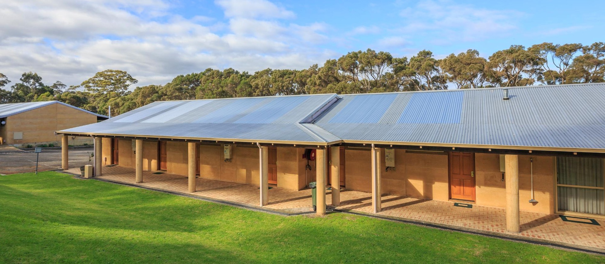
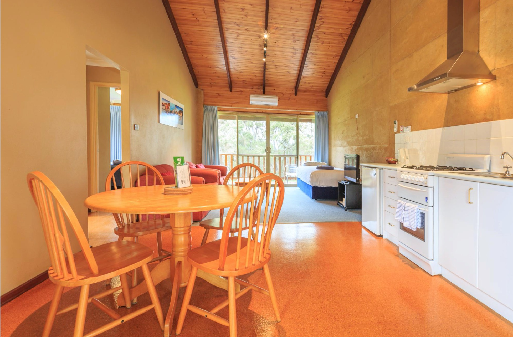
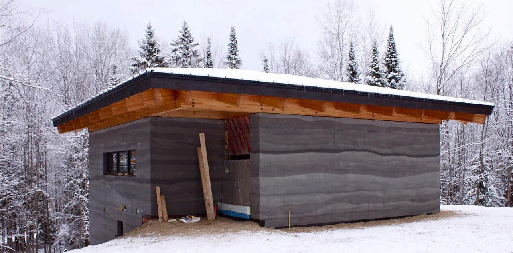
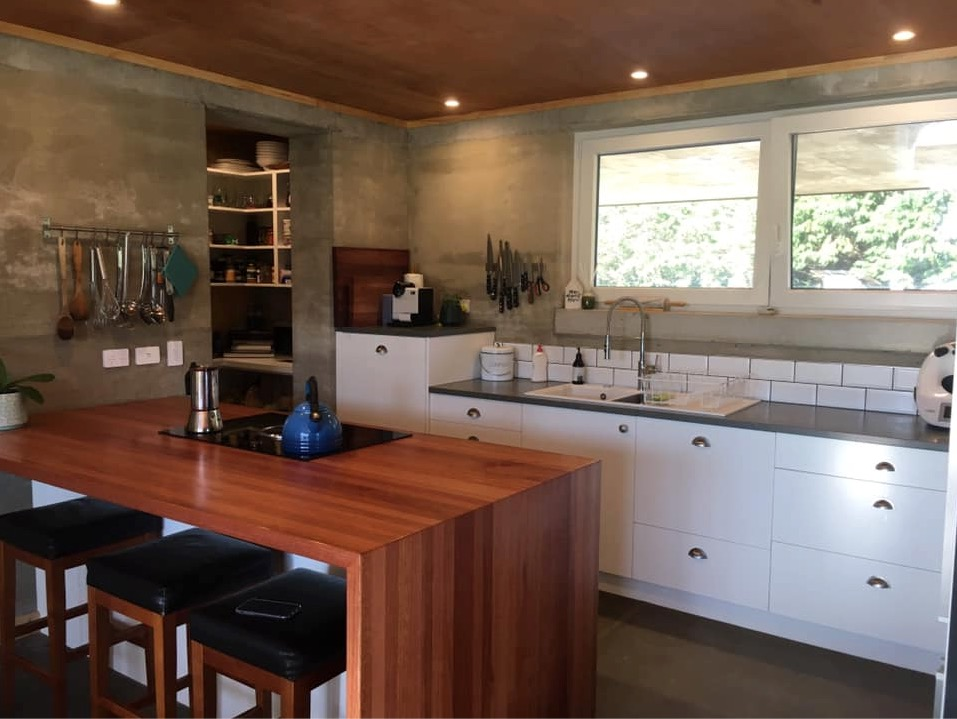
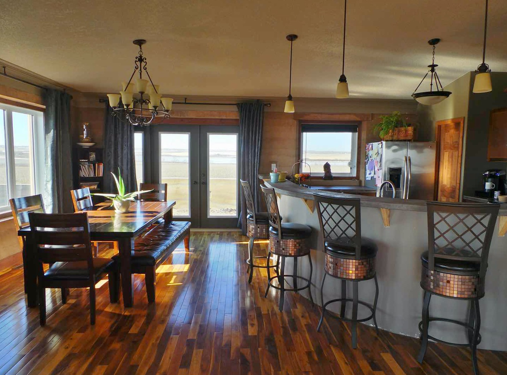
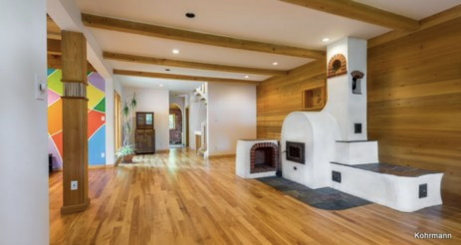

Working title: "My Dream Backyard House/ADU/round-one-of-building-experiment"

I'm trying to build a kinda cool, quirky, sensitive-to-supply-chain-disruption, cheap, functional, emotionally healing home in my back yard. We love to host friends and family, guests, maybe AirBnB sometimes, have extra space for a growing family, etc.

I hope that this document might someday get shared with various persons who are helping us execute on aspects of the plan, or just folks I've talked to IRL who want to know some of the books I've mentioned to them[^book-recommendations].

I'll probably reference this page when working with the city for permits and approvals, because some of what I do falls outside of the International Building Code, and thus isn't really on the radars of local municipalities.

[^book-recommendations]: I care a lot about having well-informed thinking. I also dislike overly-analytical approaches, so... i'm trying to find a good line for explaining myself: a pattern language, poodr, owd, hpmor, wtc.

Basically, I've had [A Pattern Language](https://www.amazon.com/Pattern-Language-Buildings-Construction-Environmental/dp/0195019199) floating around my head for two years, and [patterns of home](https://www.amazon.com/gp/product/156158696X/ref=ox_sc_act_title_8?smid=APJ60QDWVW1X7&psc=1), and finally have taken an interesting plunge into object-oriented design principles for my new job. Did you know that the author of _A Pattern Language_ is like... the Godfather of OO design?

and and just a few days ago[^in-feb-2022] the last big piece clicked into place in my head - masonry heaters!

[^in-feb-2022]: I wrote this line (and much of this page) back in feb 2022.

I've long been interested in [earthships](https://en.wikipedia.org/wiki/Earthship), but was always put off by how strange they look, and how much labor they took. You kinda had to commit to the earthship lifestyle. I don't want that - I want to build a house that my mother-in-law will live in for a long time, and learn some useful skills along the way.

This desire (and how it connects to 'repair') came full-circle as I was thinking through how to improving/understanding/being-effective-in the parts of the codebase my work has me interacting with.

I've been working a bit with Szezbi, [@Solarchitects](https://twitter.com/Solarchitects), on figuring out some of these patterns, and how they might be applied on a simple 'house' in my back yard.

# Informing Ideas

Here's a list of the concepts I'm working into my plans, and I think could be worked into other plans. Per _A Pattern Language_ I've committed to no specific layout, but I've got some components of this house I am building.

## Rammed Earth Walls

[Rammed Earth](https://en.wikipedia.org/wiki/Rammed_earth) is a very old, traditional style of building that can look surprisingly modern.

[Building envelopes](https://en.wikipedia.org/wiki/Building_envelope) can be built out of dirt, about 18" thick, in a huge variety of shapes. So, by building a square, or something close to it, one can have an extremely solid, basic structure that stays warm in the winter, cool in the summer, keeps the interior quiet, and is super cheap.

"built out of dirt" is a provocative way to say it, though. Clay and bricks are "mud and water and straw", and obviously one can build _beautiful_ brick buildings.

### Example pictures

Take a look at these rammed earth structures!

_They can be built quickly, with surprisingly basic pieces of equipment._

They can be beautiful on the inside.

I love kitchens.

The kitchen would be the location of the masonry heater, more on that below.

### Specific drawbacks/challenges to rammed earth walls in a sometimes-quite-cold environment: it's an inherently cold/cool structure

I recently came to more clearly understand some of the challenges to rammed earth walls and moderating low temperatures.

I like the ideas of passive cooling, and rammed earth is great at that kind of thing.

It's a bit trickier in cold environments, because of the intersection of thermal mass and 'radient heat', etc. The masonry heater book discussed below is a great starting point into the science.

Anyway, rammed earth walls would need to be insulated. There's different ways/amounts of insulation you'll need. Working on sorting that out right now.

Embedded in kitchens can be the house's source of heat, which is powered in very smooth cycles by a once-or-twice act of putting logs in a small fire:

## Masonry Heaters

I just finished reading [Masonry Heaters: Designing, Building, and Living with a Piece of the Sun](https://www.amazon.com/Masonry-Heaters-Designing-Building-Living/dp/1603582134/ref=asc_df_1603582134/?tag=hyprod-20&linkCode=df0&hvadid=312128022127&hvpos=&hvnetw=g&hvrand=10995947443356282066&hvpone=&hvptwo=&hvqmt=&hvdev=m&hvdvcmdl=&hvlocint=&hvlocphy=1014524&hvtargid=pla-624335379727&psc=1) and think they're the best.

I could go on and on, and will when I can pull the book notes (and photos) assembled soon. Here's a few pictures:

In the meantime, I've checked in on local masonry heater companies, and one could get a small/basic heater installed for <$10k right now. ([http://www.greenstoneheat.com/](http://www.greenstoneheat.com/) has offices in Denver, they've been great in email back-and-forth)

Pick something you care about, and masonry heaters make more of it in the world.

They are: environmentally healthy, cheap, quiet to build and install, long-lasting, low-maintenance, community-encouraging, high-availability, high-resiliency pleasant heat for life, even if the power goes out and the sun goes in.

Rammed Earth walls + good use of sun and shade and well-insulating windows + masonry heaters = an absolutely lovely place to live.

## Plants & Food

I love plants. So much. I love so much of the metaphor of gardening, and patient, long-term investment in slowly improving a specific place.

My wife and I are _mostly_ vegetarian, and eat lots of greens and veggies. I

Watch the documentary [Fantastic Fungi](https://www.youtube.com/watch?v=bxABOiay6oA), and read [The Hidden Life of Trees](https://www.amazon.com/Hidden-Life-Trees-Communicate_Discoveries-Secret/dp/1771642483). I could list another ten books, a few more documentaries. I'm not _skilled_ with plants at all, yet, but that will change.

Plants and food grow really well, and are made more resistant to dryness, pests/insects, etc.

## "Improved depth of high-quality soil in my yard"

Our lot is 6,881 sq ft, or 639 sq. meters. Obviously not all meters are the same, or equally valuable, but overall I'd rather decrease the amount of my lot covered with concrete and asphalt, and increase the amount of my lot covered with mulch, grass, plants, shrubs, small trees, and large trees. When we moved in, a lot of the lot was bare dirt, and a lot of it had asphalt or concrete on it.

<blockquote class="twitter-tweet">
This article about soil (<a href="https://t.co/Rs2FW2BeMB">https://t.co/Rs2FW2BeMB</a>) touches on issues of *great* significance. Composting, recycling, &quot;regenerative ag&quot;, increasing depth and square meters of &quot;healthy soil&quot; ties directly to capital-w Wellbeing.
&mdash; Josh (@josh_works) <a href="https://twitter.com/josh_works/status/1524484990280650752?ref_src=twsrc%5Etfw">May 11, 2022</a></blockquote> 

It's easier to point all this stuff out than write thousands of words about.

## Home Composting All Recyclables

A friend nerd-sniped me with [this book](https://www.amazon.com/gp/product/0964425882/ref=ox_sc_act_title_1?smid=ATVPDKIKX0DER&psc=1) and I cannot unread it. Solves a few interesting problems, but critically, _generates enough compost to fertilize quite a lot of soil_ which can then support quite a bit of plant life. Have you heard anything about fertilizer prices recently?

Also, near-endless convenience upgrades. Least-smelly option of all food waste disposal options I've ever used. Our trash containers are now racoon-proof.

Also, naturally supports above goals.

### Other goals

- I'm trying to pilot what a personal back-yard version of [micro housing](https://www.sightline.org/2017/03/20/how-seattle-killed-micro-housing-again/) could be like.
