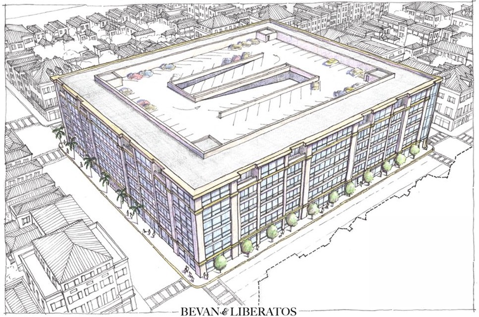
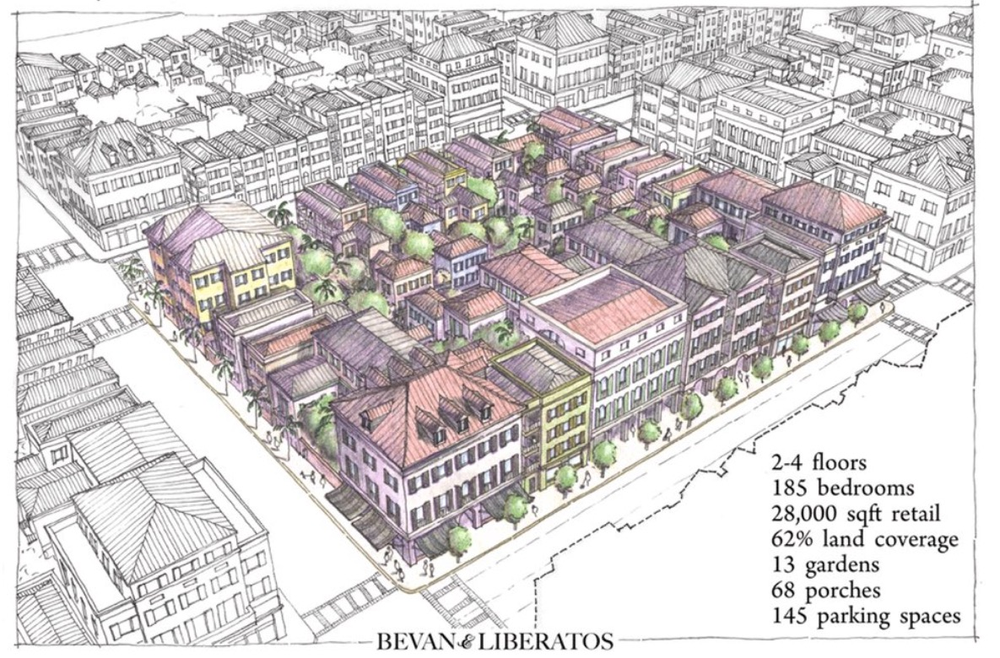
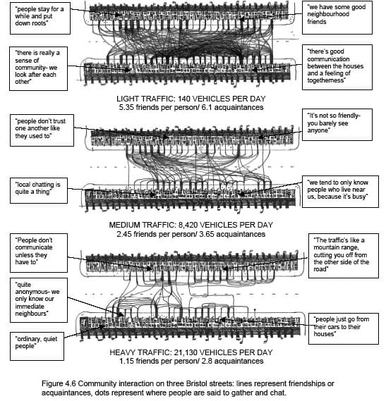

👋, I'm Josh.

This website serves as scratch pad for my ideas and words.

I value coherence, meaningfulness, compassion, and kindness.

Overall, I care a lot about "cities", the built urban form, transportation networks, and how issues of ethics play out in these domains. 😬

America is full of this:

I desire to nudge the ecosytem towards producing more of this:

Pretty much all forms of human flourishing go up, and many forms of human suffering become less, when the landscape looks more like the former, above.

Additionally, consider not just a block or a store-front, but what would be directly opposite that block:

The `cost per square meter` and `value per square meter` of these two competing visions are quite different. 

I'm currently working on nudging this ecosystem in a variety of ways, and always interested in increasing my impact. Feel free to [email me](mailto: joshthompson@hey.com).

Overall, I aim to combine/embody the influences of several distinctive persons, like Alain and Marie-Agnes Bertaud[^data-driven-urban-economist], Christopher Alexander[^design-patterns], and other distinguished individuals, and figure out some small, practical 'details of the urban environment'.



## Footnotes

[^data-driven-urban-economist]: Marie-Agnes, and her partner-in-crime co-author Alain Bertaud wrote [this book](https://www.goodreads.com/book/show/39644188-order-without-design) and [this paper](https://alainbertaud.com/wp-content/uploads/2013/08/Efficiency-in-Land-Use-and-Infra-Design-Bertaud-Model_a.pdf). He and Marie-Agnes are the subjects of [this podcast](https://devonzuegel.com/tag/order-without-design-podcast). IYKYK. 

[^design-patterns]:  Christopher Alexander basically formalized the concept of `design patterns`, in both architecture AND computer science!!! He reminds me of [Claude Shannon](https://josh.works/driven-by-compression-progress-novelty-humor-interestingness-curiosity-creativity#fn:shannon). 

    Design patterns, as he conceived of them, are at the core of the object-oriented software development I use most days (Ruby/Rails), _and_ design patterns are at the core of his contribution to architecture and physical spaces. I had known Christopher Alexander for years as the author of [A Pattern Language: Towns, Buildings, Construction](https://www.amazon.com/Pattern-Language-Buildings-Construction-Environmental/dp/0195019199), and had always tried to channel the same ideas when working on software projects. 
    
    Only in the last year did I learn of [his influence in computer science](https://en.wikipedia.org/wiki/Christopher_Alexander#Computer_science). He passed away in late 2022, and [this eulogy](https://dorian.substack.com/p/at-any-given-moment-in-a-process?s=r) is perhaps the best introduction to this incredible person.